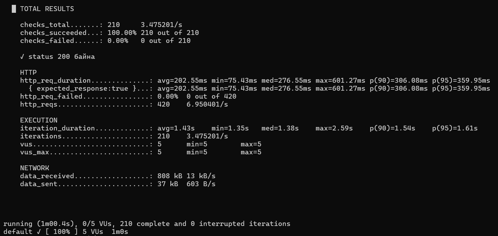
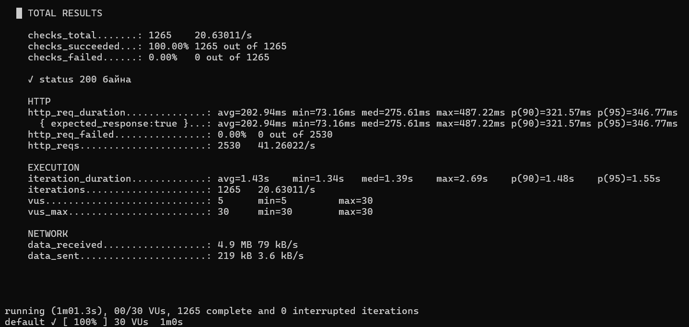
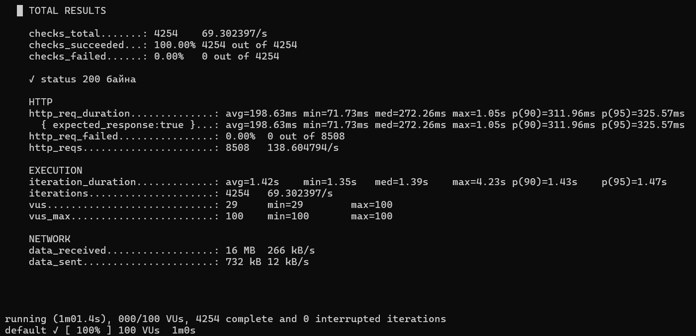
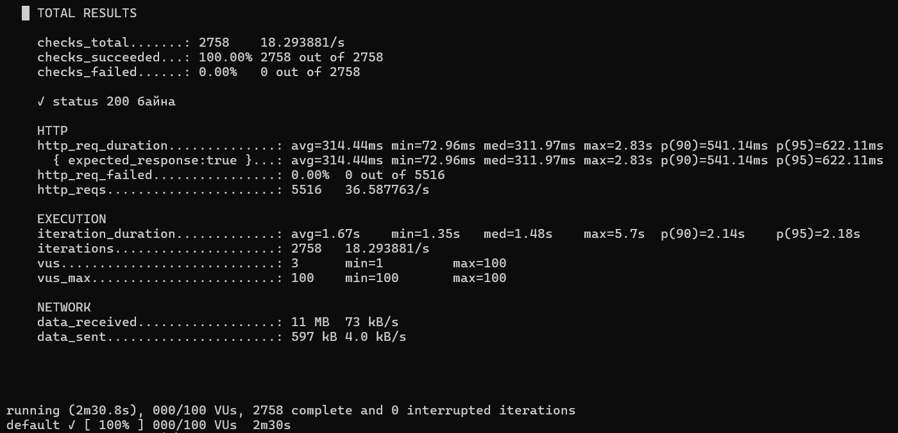
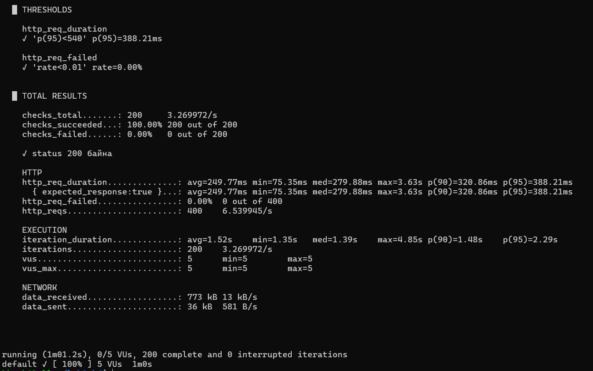
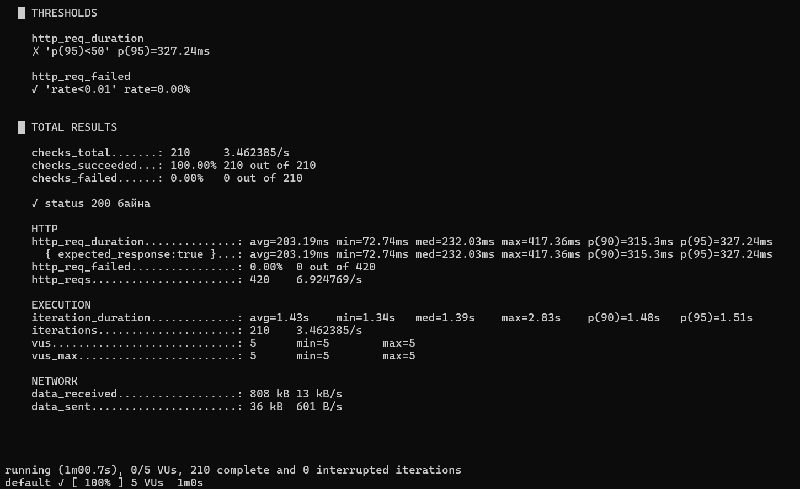
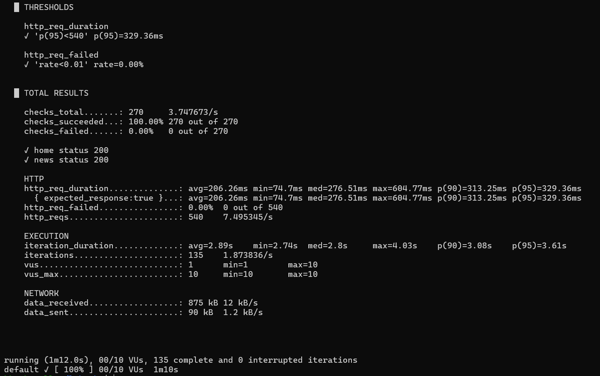

# F.CSA313 – Лаборатори №2
## Гүйцэтгэлийн хэмжүүрийг k6-аар хэмжих

**Оюутны нэр:** Ж.Буянхишиг  
**Оюутны код:** B232270114  
**Хичээлийн код:** F.CSA313  

---

## Зорилго

Энэхүү лабораторийн ажлын зорилго нь k6 ашиглан системийн гүйцэтгэлийн үндсэн хэмжүүрүүд болох latency (p90, p95), throughput, error rate болон availability-ийг хэмжих, мөн хэрэглэгчийн ачаалал нэмэгдэх үед эдгээр үзүүлэлт хэрхэн өөрчлөгдөж байгааг туршихад оршино.

Туршилтын зорилтот системээр k6-ийн албан ёсны туршилтын сайт болох `https://test.k6.io`-г ашигласан.

---

## Ашигласан орчин

- OS: Ubuntu on WSL2
- Load testing tool: k6
- k6 version: `k6 v2.2.0 (commit/00a9a1b7f5, go1.26.5, linux/amd64)`
- Test target: `https://test.k6.io`
- Version control: Git, GitHub

---

## 1. Basic болон Load Test

Системийг 5, 30, 100 Virtual User (VU)-ийн тогтмол ачааллаар тус бүр 1 минут туршсан.

| VU | p90 latency | p95 latency | Throughput | Error rate |
|---:|---:|---:|---:|---:|
| 5 | 306.08 ms | 359.95 ms | 6.95 req/s | 0.00% |
| 30 | 321.57 ms | 346.77 ms | 41.26 req/s | 0.00% |
| 100 | 311.96 ms | 325.57 ms | 138.60 req/s | 0.00% |

### 1.1 5 VU Baseline Test

5 VU ашиглан системийг 1 минутын турш ажиллуулж baseline хэмжилтийг авсан.

Үр дүн:

- p90 latency: `306.08 ms`
- p95 latency: `359.95 ms`
- Throughput: `6.95 req/s`
- Error rate: `0.00%`
- Нийт HTTP request: `420`
- Checks succeeded: `100%`

Энэ туршилтын p95 утгыг дараагийн SLO threshold-ийг тодорхойлох baseline болгон ашигласан.

### 1.2 30 VU Load Test

Ачааллыг 30 VU болгон нэмэгдүүлж 1 минутын турш туршсан.

Үр дүн:

- p90 latency: `321.57 ms`
- p95 latency: `346.77 ms`
- Throughput: `41.26 req/s`
- Error rate: `0.00%`
- Нийт HTTP request: `2530`
- Checks succeeded: `100%`

5 VU-тай харьцуулахад throughput мэдэгдэхүйц нэмэгдсэн боловч p95 latency огцом өсөөгүй.

### 1.3 100 VU Load Test

Ачааллыг 100 VU болгон нэмэгдүүлж 1 минутын турш туршсан.

Үр дүн:

- p90 latency: `311.96 ms`
- p95 latency: `325.57 ms`
- Throughput: `138.60 req/s`
- Error rate: `0.00%`
- Нийт HTTP request: `8508`
- Checks succeeded: `100%`

100 VU үед throughput хамгийн өндөр буюу 138.60 req/s хүрсэн бөгөөд HTTP хүсэлтийн алдаа гараагүй.

### 1.4 Ажиглалт

5 VU үед p95 latency 359.95 ms, throughput 6.95 req/s байсан. 30 VU үед throughput 41.26 req/s болж нэмэгдсэн бөгөөд p95 latency 346.77 ms байв. 100 VU үед throughput 138.60 req/s хүрч, p95 latency 325.57 ms болсон. Туршилтын хүрээнд VU-ийн тоо өсөхөд throughput мэдэгдэхүйц нэмэгдсэн. Харин p95 latency тогтмол өсөх хандлага ажиглагдаагүй. Мөн 5, 30, 100 VU-ийн бүх туршилтад HTTP error rate 0.00% гарсан.

---

## 2. Staged Load Test

Системийн ачааллыг үе шаттайгаар нэмэгдүүлж, бууруулах staged load test хийсэн.

Ачааллыг дараах байдлаар тохируулсан:

- 30 секунд: 5 VU
- 1 минут: 30 VU
- 30 секунд: 100 VU
- 30 секунд: 0 VU

### Staged Test үр дүн

| Metric | Result |
|---|---:|
| Average latency | 314.44 ms |
| p90 latency | 541.14 ms |
| p95 latency | 622.11 ms |
| Maximum latency | 2.83 s |
| Throughput | 36.59 req/s |
| Error rate | 0.00% |
| Maximum VU | 100 |
| Checks succeeded | 100% |

Staged load test-ийн үед p95 latency `622.11 ms` болж, тогтмол 5, 30, 100 VU-ийн туршилтуудаас өндөр гарсан. Maximum response time нь `2.83 s` хүрсэн. Энэ нь ачааллыг үе шаттайгаар өөрчлөх үед response time илүү хэлбэлзэж болохыг харуулсан. Гэсэн хэдий ч HTTP error rate `0.00%` бөгөөд бүх check амжилттай байсан.

---

## 3. SLO болон Threshold

Гүйцэтгэлийн зорилтыг автоматаар шалгахын тулд k6-ийн threshold ашигласан.

5 VU baseline туршилтын p95 latency:

`359.95 ms`

SLO threshold-ийг baseline p95 latency-ийн 1.5 дахин их утгаар сонгосон.

`359.95 × 1.5 = 539.925 ms ≈ 540 ms`

Иймээс дараах threshold-үүдийг ашигласан:

- `http_req_duration: p(95) < 540 ms`
- `http_req_failed: rate < 0.01`

### 3.1 PASS Test

PASS туршилтад:

- p95 latency: `388.21 ms`
- Error rate: `0.00%`

Threshold-ийн үр дүн:

```text
http_req_duration
✓ 'p(95)<540' p(95)=388.21ms

http_req_failed
✓ 'rate<0.01' rate=0.00%
```

Бодит p95 latency 388.21 ms байсан бөгөөд 540 ms-ээс бага учраас latency threshold PASS болсон. Error rate 0.00% байсан тул error rate threshold мөн PASS болсон.

### 3.2 Intentional FAIL Test

Threshold-ийн FAIL ажиллагааг шалгахын тулд зориудаар маш хатуу:

`p(95) < 50 ms`

гэсэн threshold ашигласан.

Туршилтын бодит p95 latency:

`327.24 ms`

Threshold-ийн үр дүн:

```text
http_req_duration
✗ 'p(95)<50' p(95)=327.24ms

http_req_failed
✓ 'rate<0.01' rate=0.00%
```

327.24 ms нь 50 ms-ээс бага биш учраас `http_req_duration` threshold FAIL болсон. Харин HTTP error rate 0.00% байсан тул `http_req_failed` threshold PASS хэвээр байсан.

k6 мөн дараах алдааны мэдээллийг харуулсан:

```text
thresholds on metrics 'http_req_duration' have been crossed
```

Ингэснээр threshold шаардлага хангагдаагүй үед k6 тестийг автоматаар FAIL болгож байгааг шалгасан.

---

## 4. Дүгнэлт

Энэхүү лабораторийн ажлаар k6 ашиглан системийн гүйцэтгэлийг өөр өөр ачааллын нөхцөлд хэмжиж туршлаа. 5 VU baseline туршилтаар p95 latency 359.95 ms, throughput 6.95 req/s байсан. Ачааллыг 30 VU болгоход throughput 41.26 req/s болж нэмэгдсэн бөгөөд p95 latency 346.77 ms гарсан. 100 VU үед throughput 138.60 req/s хүрч, p95 latency 325.57 ms байсан. Иймээс тогтмол ачааллын туршилтын хүрээнд VU нэмэгдэхэд throughput мэдэгдэхүйц өссөн бөгөөд error rate бүх тохиолдолд 0.00% байв. Харин staged load test-ийн үед p95 latency 622.11 ms болж өссөн нь ачааллыг үе шаттай өөрчлөх үед response time илүү хэлбэлзэж болохыг харуулсан. Baseline p95 утгыг 1.5-аар үржүүлж 540 ms-ийн SLO threshold сонгоход PASS туршилтын p95 388.21 ms болж шаардлагыг хангасан. Threshold-ийг зориудаар 50 ms болгон чангаруулахад бодит p95 327.24 ms байсан учраас FAIL үр дүн гарсан. Ингэснээр k6-ийн threshold ашиглан гүйцэтгэлийн зорилтыг автоматаар шалгаж болохыг туршилтаар харууллаа. Нийт туршилтын үр дүнгээс latency, throughput болон error rate нь системийн гүйцэтгэлийг үнэлэхэд чухал хэмжүүрүүд болохыг ойлголоо.

---

## 5. Result Files

Туршилтын бүрэн үр дүнг `results/` хавтсанд хадгалсан.

- `run-05vu.txt`
- `run-30vu.txt`
- `run-100vu.txt`
- `run-stages.txt`
- `threshold-pass.txt`
- `threshold-fail.txt`
- `ai-scenario.txt`
- `k6-version.txt`

---

## 6. Scripts

Туршилтад дараах k6 script-үүдийг ашигласан.

- `script.js` – Basic болон 5/30/100 VU load test
- `stages.js` – Staged load test
- `threshold-pass.js` – SLO PASS test
- `threshold-fail.js` – Intentional SLO FAIL test
- `ai-scenario.js` – AI-assisted user scenario test

---

## 7. Нэмэлт даалгавар – AI ашигласан туршилт

Энэ нэмэлт даалгаврын хүрээнд ChatGPT ашиглан хэрэглэгч эхлээд үндсэн хуудсанд хандаж, дараа нь өөр хуудсанд хүсэлт илгээдэг k6 scenario үүсгүүлж туршсан. AI-ийн санал болгосон target URL-уудыг ажиллуулахаас өмнө шалгаж, зөвшөөрөгдсөн туршилтын сайт болох `https://test.k6.io` домэйныг ашиглаж байгаа эсэхийг баталгаажуулсан.

AI-ийн гаргасан скрипт үндсэндээ шууд ажилласан бөгөөд threshold-ийн утгыг өөрийн baseline хэмжилтэд үндэслэн `p(95)<540` болгон тохируулсан. Туршилтын үед p95 latency `329.36 ms`, p90 latency `313.25 ms`, throughput `7.50 req/s`, error rate `0.00%` гарсан. `p(95)<540` болон `rate<0.01` threshold-үүд хоёулаа PASS болсон бөгөөд үндсэн болон news хуудсын status check-үүд мөн амжилттай ажилласан. AI нь stages, threshold болон check-ийн бүтцийг зөв санал болгосон нь давуу талтай байсан. Өөрийн бичсэн скрипттэй харьцуулахад AI-ийн хувилбар хэрэглэгчийн олон алхамтай scenario-г хурдан үүсгэж, кодын үндсэн бүтцийг нэг дор бэлдсэн нь илүү хялбар байв. Харин AI нь бодит туршилтын орчин, зөвшөөрөгдсөн target URL болон baseline хэмжилтийн утгыг урьдчилан мэдэхгүй учраас гаргасан URL болон threshold-ийг шууд ашиглах нь тохиромжгүй байж болохыг анзаарсан. Иймээс AI-ийн гаргасан k6 скриптийг ажиллуулахын өмнө target URL, ачааллын хэмжээ, threshold болон ёс зүйн шаардлагыг заавал шалгах шаардлагатай гэж дүгнэсэн.

### AI Scenario Test-ийн үр дүн

| Metric | Result |
|---|---:|
| p90 latency | 313.25 ms |
| p95 latency | 329.36 ms |
| Average latency | 206.26 ms |
| Maximum latency | 604.77 ms |
| Throughput | 7.50 req/s |
| Error rate | 0.00% |
| Maximum VU | 10 |
| Checks succeeded | 100% |

AI scenario test-ийн threshold үр дүн:

```text
http_req_duration
✓ 'p(95)<540' p(95)=329.36ms

http_req_failed
✓ 'rate<0.01' rate=0.00%
```

Мөн хоёр хуудасны шалгалт хоёулаа амжилттай болсон:

```text
✓ home status 200
✓ news status 200
```

---

## 8. Screenshots

Туршилтын үр дүнгийн screenshot-уудыг `screenshots/` хавтсанд байрлуулна.

Screenshot-уудаар дараах үндсэн үр дүнг харуулна:

- 5 VU baseline test
- 30 VU load test
- 100 VU load test
- Staged load test
- SLO Threshold PASS
- SLO Threshold FAIL
- AI-assisted scenario test
### 5 VU Baseline Test


### 30 VU Load Test


### 100 VU Load Test


### Staged Load Test


### SLO Threshold PASS


### SLO Threshold FAIL


### AI-assisted Scenario Test

---

## Repository Structure

```text

lab2-k6/
├── script.js
├── stages.js
├── threshold-pass.js
├── threshold-fail.js
├── ai-scenario.js
├── README.md
├── results/
│   ├── run-05vu.txt
│   ├── run-30vu.txt
│   ├── run-100vu.txt
│   ├── run-stages.txt
│   ├── threshold-pass.txt
│   ├── threshold-fail.txt
│   └── ai-scenario.txt
└── screenshots/
```
